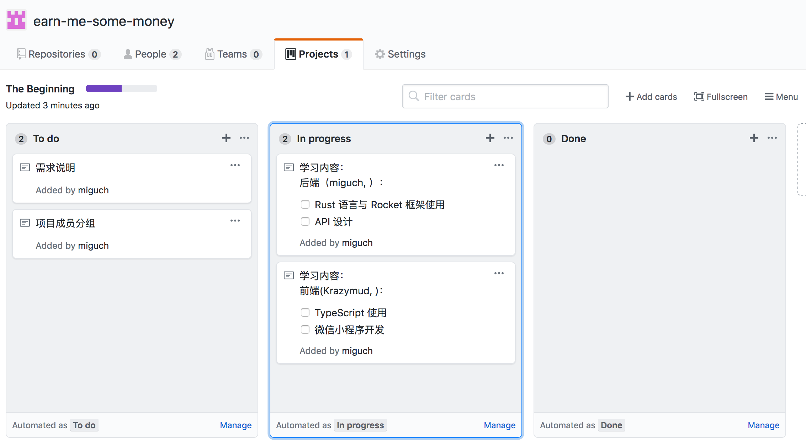
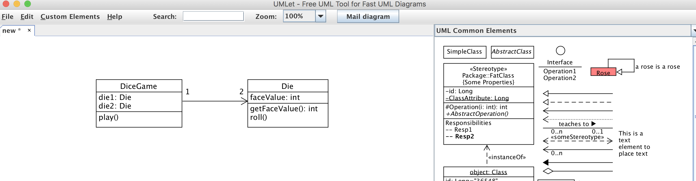
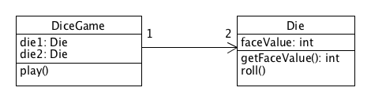

# 软件系统分析与设计作业 2

## 简答题

- 用简短的语言给出对分析、设计的理解。

  分析和设计是在建模阶段的工作，分析是根据需求对软件系统进行研究以确定系统需要实现的目标与功能以及有效率地达到该目标的方法，强调对问题的分析。设计则是在分析的基础上，对针对目标环境的实现方案进行细节上的构建，对系统中对象实例及其行为进行设计，对于实际环境中的情况有更多的考虑，强调对软件解决方案的分析。

- 用一句话描述面向对象的分析与设计的优势。

  面向对象的分析与设计的优势在于其有着较为直观的表述，而且通过同一种建模标记法将分析与设计结合，令设计与分析的人员可以更有效地进行沟通。

- 简述 UML（统一建模语言）的作用。考试考哪些图？

  UML 是用于对分析与设计的结果进行可视化描述的建模语言，可被用于可视化问题或解决方案的困难部分，可帮助通过可视化来更好地理解现有代码或进行代码生成。从概念角度上，UML 可被用于描述现实或其他领域中的物件；在软件规范角度上，UML 可被用于在脱离编程语言的范围下描述软件抽象或组建的规范或接口；在软件实现的角度上，UML 可用于描述软件在特定的语言或技术中实现的细节。

  UML 有十多种视图，分为 4 类：

  - 用例图
  - 静态图，其中包含类图、对象图以及包图
  - 行为图，包含交互图、状态图以及活动图
  - 实现图， 分为构件图和部署图

- 从软件本质的角度，解释软件范围（需求）控制的可行性

  软件本身具有复杂性、不可见性、不一致性和可变性，软件范围多数情况下是模糊的。但软件开发过程中可以通过 2/8 法则对需求和进度进行评估，对成本、需求时间、资源等作出大概的估计，从而对软件需求和工程进行符合现实的调整，实现对软件范围的控制。

## 项目管理实践

- 看板使用练习（提交看板执行结果贴图，建议使用 Git project）

  通过 GitHub Project 使用 KANBAN，将任务分为 To Do, In Progress 和 Done 三部分。

  

- UML 绘图工具练习（提交贴图，必须使用 UMLet）

  使用 UMLet 对教材 49 页 Figure 1.6 进行绘图练习：

  

  导出后效果如下：

  
