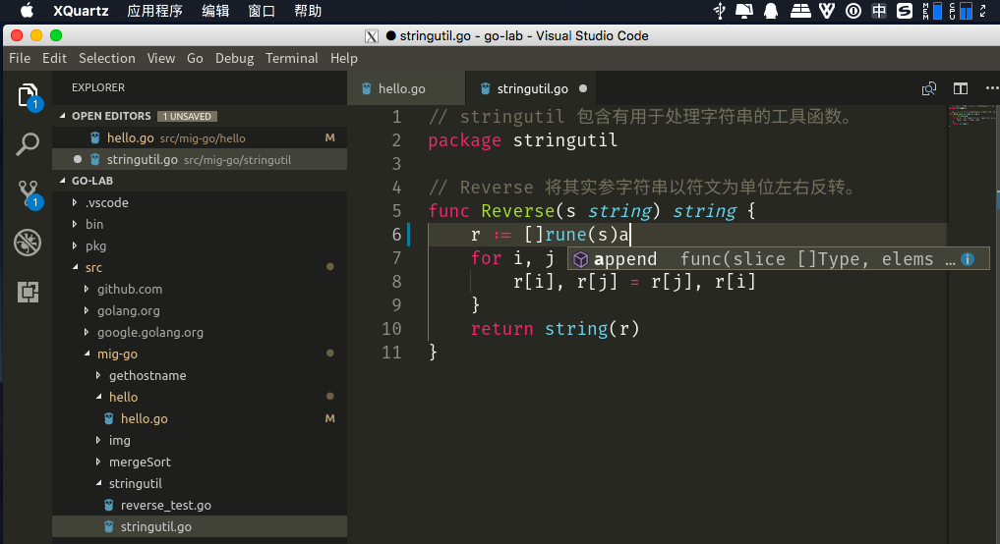
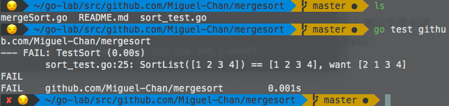

# Ubuntu 18.04 虚拟机下安装配置 Go 语言环境

## 材料准备

本文使用的虚拟机为此前的博客文[Mac 环境下使用 VirtualBox 部署 Ubuntu 18.04 私有云](https://blog.chenmt.science/2018/09/09/77/) 中所搭建的虚拟机，系统版本为 Ubuntu 18.04.1 LTS。

## 在宿主机中使用虚拟机的 VScode

​ 若您跟我一样，使用的是较老款的 Mac 机型，可能也会碰到之前安装的 Ubuntu 虚拟机的桌面界面极其卡顿的问题，甚至可能连桌面环境下用户登录都无法进行。一个可替代的方式是通过 ssh 的 X11 forwarding 来使用虚拟机中的图形界面程序，虽然还是卡卡的，但是至少还能用。

###安装 X11

在 Mac 下配置 X11 forwarding 方式比较简单，首先要安装 XQuartz（[下载地址](https://www.xquartz.org/)）, 这是 Apple 在 MacOS 下的一个 X11 实现（[什么是 X11？](https://zh.wikipedia.org/wiki/X_Window%E7%B3%BB%E7%B5%B1)）。

### ssh

安装完成后，使用 ssh 连接虚拟机时改用如下的命令：`ssh -Y <虚拟机 ip>`，其中的 `-Y` 参数作用是启用可信任的 X11 forwarding，此时当你在 ssh 中启动有图形界面的程序时，应该就可以看到程序在 MacOS 中直接显示出来了。

### 安装 VScode

安装过程直接按照官网流程即可：

1.  下载 deb 文件

`wget https://az764295.vo.msecnd.net/stable/f46c4c469d6e6d8c46f268d1553c5dc4b475840f/code_1.27.2-1536736588_amd64.deb`

2. 安装

   `sudo dpkg -i code_1.27.2-1536736588_amd64.deb`

3. 安装依赖

   `sudo apt-get install -f`

### VScode 配置

此时在 ssh 中输入`code`应该就能看到 VScode 启动了，界面长这样：

然而，你输了几个键进去后却可能会发现键盘按键对应不上，比如退格键没用了，按 e 变成了退格键，等等。这是由于 VScode 在 X11 中的 Keyboard mapping 出了问题。这时候，我们要到 VScode 的设置中，搜索“patch”（这几个键输入是没有问题的），找到 Keyboard:Dispatch 设置，将其改为"keyCode"，重新打开，应该就能看到按键的输入都正常了。

最后，我们到 VScode 的扩展管理中，安装名为“Go”的插件，在下面 Go 配置完成后就可以直接在 VScode 中进行调试了。

## Go 配置过程

使用 apt 是最方便的安装 Go 的方式，只需要输入命令`sudo apt install golang` 即可将 go 安装入系统。

安装后还需要配置相关环境变量以保证 go 的运行正常

### 1

首先要设置 GOPATH，这是 go 唯一需要设置的环境变量，它是 go 编译过程中查找代码包的地址，结构大致如下：

```
    /home/user/go/
        src/
            foo/
                bar/               (go code in package bar)
                    x.go
                quux/              (go code in package main)
                    y.go
        bin/
            quux                   (installed command)
        pkg/
            linux_amd64/
                foo/
                    bar.a          (installed package object)
```

其在 \*nix 系统中默认位置为`$HOME/go` ，可以通过如下方式更改：

假定我们希望将目录改至`~/go-lab` , 可以通过下面的命令完成：

`export GOPATH=~/go-lab`

但是，这个命令在重启 SHELL 后便会失效，我们可以把它写入配置文件中，我使用的 SHELL 为 zsh，所以修改`~/.zshrc`文件；若你使用的是 bash，则需修改`~/.bash_profile` 文件，直接将该命令写入文件末尾即可。

此外，若你希望可以直接调用通过 `go install` 安装至`$GOPATH/bin`下的可执行文件。可以在以上的命令后再加一句`export PATH=$PATH:$GOPATH/bin`。

## 2

我们编写的代码都放置在 GOPATH 的 src 文件夹下，按照包划分，使用`go build` 或`go install` 命令来进行编译或安装编写好的 go 程序。

## 使用 Gotour 来进行 Go 学习

Go 提供了 Gotour 教程来帮助初学者快速入门，可以通过以下方式安装至本地：

`go get github.com/Go-zh/tour/gotour`

由于我的虚拟机的图形环境使用极为卡顿，所以通过以下方式来从宿主机访问虚拟机提供的 web 服务：

在 VirtualBox 的虚拟机的设置界面->网络->网卡 1->高级->端口转发中增加对虚拟机 3999 端口的转发，然后在虚拟机中输入`gotour -http 192.168.100.101:3999`命令（其中的 ip 地址需要换为你的虚拟机的实际地址）即可启动 Gotour 并监听在 3999 端口。此时在宿主机浏览器中访问 192.168.100.101:3999 就可以看到 Go 语言之旅教程了。

## Go 测试

你试着写好了你的第一个 Go 包，怎么测试你编写的函数是否正确呢？Go 提供了 test 功能，可以让我们方便地进行测试，这里使用我之前所编写的一个实现归并排序的程序进行测试，代码可以直接通过`go get github.com/Mingtao-Chan/mergesort` 获取到`$GOPATH/src` 下，尝试运行`go test github.com/Mingtao-Chan/mergesort` 看看结果如何。

测试代码文件中需要 `import "testing"` 用于测试，测试时会运行测试文件中诸如`func TestSort(t *testing.T)` 的函数，当`t.Error`, `t.Fail`, `t.Errorf`等函数运行时，测试失败，失败时显示如下：



（以上失败的用例是故意为之，仅做演示）

## 提交至远程仓库

编写好我们的包后，我们一般会使用 Git 工具进行版本管理，对于以后代码的维护与管理可以方便很多。操作如下：

1. 首先我们配置好 Git 提交时所使用的用户名与邮箱，一些远程仓库如 GitHub 或 Bitbucket 会使用邮箱识别提交的用户。

   `git config -- global.name <用户名>`

   `git config --global user.email <邮箱>`

2. 创建仓库并添加现有代码：

   `git init`

   `git add .`(此命令会将目录下所有文件添加入 Git 仓库，若文件中有敏感信息或有没有必要添加入仓库的文件请使用.gitignore 进行排除)

   `git commit -m "<代码提交注释>"`

3. 将本地仓库 push 至远程仓库：

   `git remote add origin <远程仓库链接>`

   `git push -u origin master`

当我们将代码包 push 至远程仓库后，可以在其他电脑上通过`go get <远程仓库链接>` 的方式直接将远程仓库的代码下载至本地，若 package 为 main，则会自动执行 install。
